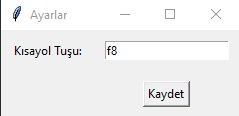
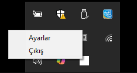

# ScreenOff
A Windows program for turning your monitor off with a button press.

# ScreenOff

**ScreenOff** is a lightweight screen-off application for Windows that allows you to turn off your monitor by pressing a designated hotkey (default: `F12`). The application runs in the system tray, consumes minimal resources, and uses the Windows API to turn off the monitor without relying on third-party tools.

## Features

- **Hotkey-based Screen Off:**  
  Press the default `F12` key (or any key you configure) to turn off your monitor.

- **System Tray Icon:**  
  The application runs silently in the system tray. Right-click the tray icon to access the Settings window or to exit the application.

- **Admin Privileges Required:**  
  The application requests administrator privileges upon launch to ensure it can successfully send the monitor power-off command using the Windows API.

- **Windows API for Screen Off:**  
  Uses `ctypes.windll.user32.SendMessageW(0xFFFF, 0x0112, 0xF170, 2)` to send the screen-off command, eliminating the need for external utilities.

## Installation

### Running in a Development Environment

1. **Clone the Repository:**
    ```bash
    git clone https://github.com/alibaztomars/ScreenOff.git
    cd ScreenOff
    ```

2. **Install Required Python Packages:**
    ```bash
    pip install -r requirements.txt
    ```
    *If you don't have a `requirements.txt` file, make sure to install these packages manually: `pystray`, `keyboard`, `Pillow`, `infi.systray`, `requests`, and any others required by the project.*

3. **Run the Application:**
    ```bash
    python ScreenOffApp.pyw
    ```

### Converting to an EXE

You can convert the application into a standalone **.exe** file using [PyInstaller](https://pyinstaller.readthedocs.io/en/stable/). This ensures that the application includes all dependencies and runs on any Windows machine without requiring Python to be installed.

1. **Install PyInstaller:**
    ```bash
    pip install pyinstaller
    ```

2. **Generate the EXE:**
    ```bash
    pyinstaller --onefile --noconsole --icon=icon.ico ScreenOffApp.pyw
    ```
    - `--onefile`: Generates a single executable file.
    - `--noconsole`: Prevents the console window from opening when the application runs.
    - `--icon=icon.ico`: (Optional) Specifies an icon for the application. Remove this option if you do not have an icon file.

3. **Locate the Executable:**
    The generated EXE file will be located in the `dist` directory as `ScreenOffApp.exe`.

## Usage

1. **Start the Application:**  
   When you launch the application, it will request administrator privileges and then run in the system tray.

2. **Turn Off the Screen:**  
   Press the default hotkey `F12` (or your configured hotkey) to turn off the monitor.

3. **Access the Settings Window:**  
   Right-click the system tray icon and select **"Ayarlar" (Settings)** to change the hotkey if needed.

4. **Exit the Application:**  
   Right-click the system tray icon and select **"Çıkış" (Exit)** to close the application.

## Screenshots

Some images about the program.

- **Program Icon:**  
  

- **Settings Window:**  
  

- **Indicator:**  
  

## Developer Information

- **Project Name:** ScreenOff  
- **Language:** Python  
- **License:** [MIT License](LICENSE)  
- **Author:** alibaztomars

## Contributing

If you would like to contribute to the project, please open an issue or submit a pull request. All suggestions and feedback are welcome.

## License

This project is licensed under the MIT License. See the [LICENSE](LICENSE) file for details.

---

If you encounter any issues or have questions, feel free to open an issue on GitHub or contact the maintainer.

Happy coding!
